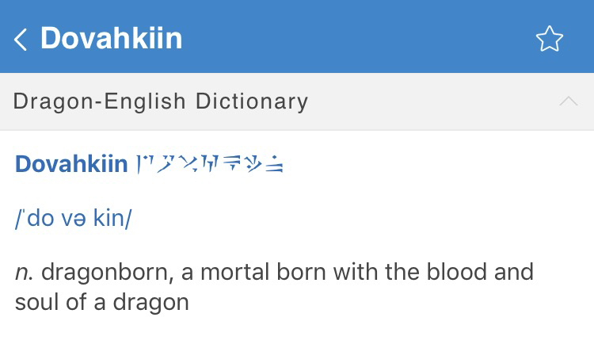

# Thuum-dict

This is a dictionary add-on of the dragon language in [*The Elder Scrolls V: Skyrim*](https://elderscrolls.bethesda.net/skyrim/). All dictionary entries are from [Thuum.org](https://www.thuum.org/).

## Usage

Import `thuum.mdx` and `thuum.mdd` to [MDict](https://www.mdict.cn/wp/?lang=en) or any other dictionary application that supports the MDict dictionary file format (*e.g.* [Eudic](https://itunes.apple.com/us/app/id367278030?mt=8) on iOS, in the screenshot below).

Or you can convert it to various dictionary file formats using tools like [pyglossary](https://github.com/ilius/pyglossary) (not tested).

## Build

If you want to modify or build the dictionary by yourselves, you will need [MDXBuilder](http://www.mdict.cn/download/MdxBuilder.zip). Take a look at `script/main.py` to see how the mdx source file is generated.

## About

This project is not affiliated with [Bethesda Softworks, LLC](https://bethesda.net/en/dashboard) or [Thuum.org](https://www.thuum.org/).

